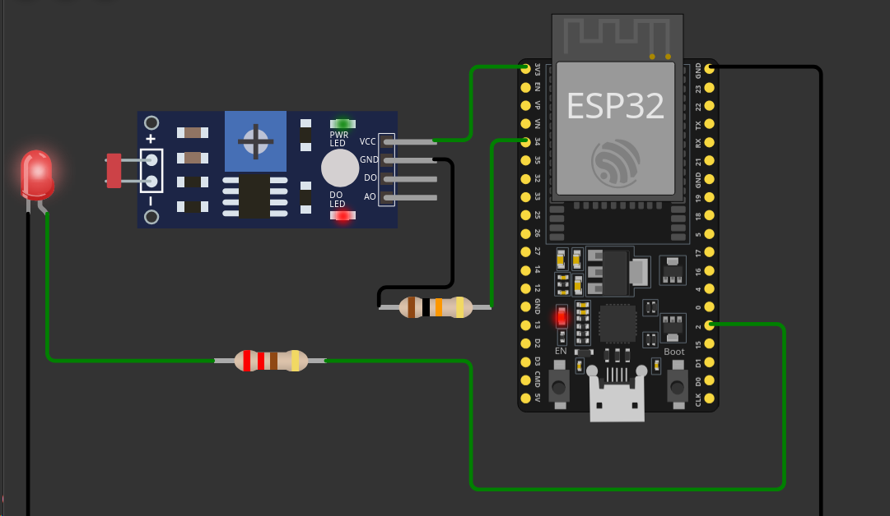

# Tarefa 1 — Protótipo e Firmware SmartLamp

## Objetivo
Montar o protótipo ESP32 com LED e LDR, e desenvolver o firmware que responde aos comandos via Serial.

## Esquema de Montagem

### Pinagem

| Componente        | Pino no ESP32   | Observação    |
|-------------------|-----------------|---------------|
| **LED**  (Ânodo)  | GPIO2           | Resistor 220Ω |
| **LED**  (Cátodo) | GND             | -             |
| **LDR**           | GPIO34          | 10kΩ para GND |
| **GND**           | Comum           | -             |
| **3.3V**          | Alimentação LDR | -             |

**Baud Rate:** 115200  
**Protocolo:** USB Serial

## Firmware

O firmware `smartlamp.ino` foi desenvolvido no Arduino IDE e suporta os seguintes comandos:

| Comando                | Resposta                |
|------------------------|-------------------------|
| `SET_LED X` (0-100)    | `RES SET_LED X`         |
| `SET_LED X` (inválido) | `RES SET_LED -1`        |
| `GET_LED`              | `RES GET_LED Y`         |
| `GET_LDR`              | `RES GET_LDR Z`         |
| Comando inválido       | `ERR Unknown command.` 
|

## Validação no Wokwi
### Serial Monitor
SmartLamp Initialized.
SET_LED 50
RES SET_LED 50
SET_LED 100
RES SET_LED 100
SET_LED 0
RES SET_LED 0
SET_LED 100
RES SET_LED 100
GET_LED
RES GET_LED 100
GET_LDR
RES GET_LDR 32
COMANDO_INVALIDO
ERR Unknown command.
